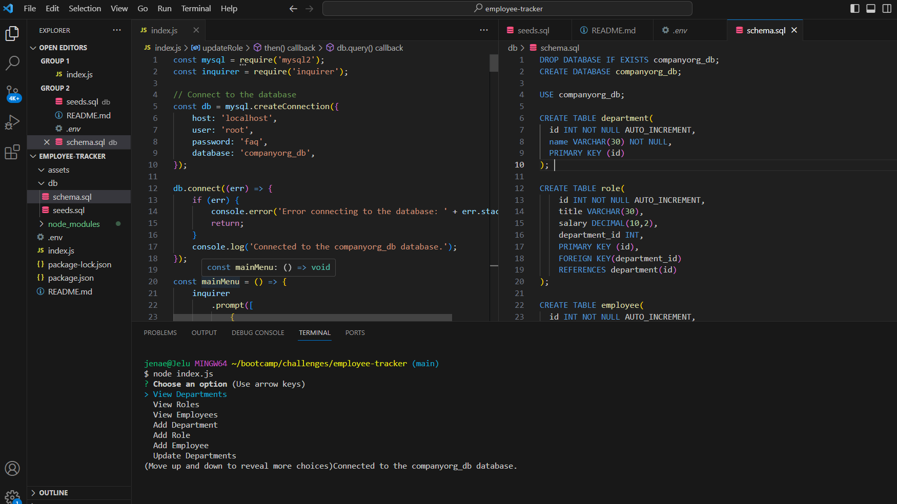

# Employee Tracker 
   Video: https://drive.google.com/file/d/13qHaf9prID9K0P4a9PYAr9VRqQ4hvhBa/view
   Github: https://github.com/Jelu113/employee-tracker
 
 ## Table of Contents
-[Description](#description)  
-[Installation](#installation)  
-[Usage](#usage)  
-[Credits](#credits)  
-[License](#license)  
-[Badges](#badges)  
-[Features](#features)  
-[How to contribute](#contribute)  
-[Tests](#tests)  

 ## Description
 
 I made this project to demonstrate my knowledge of mySQL and Node.js
 
 This application helps employers keep track of employees in different departments. 
 I learned that console.table(result) makes a fancy table in node.js and that
 the tables look great!
 I watched the class videos and I had a tutoring session, getting the schema to work with the seeds.sql and the index.js was all very tricky. 
 Someday I would love to add a front end! 

## Installation
To install this project you will need SQL and Node.js.
## Usage

## Credits
My class instructors, TA's a Tutor.

